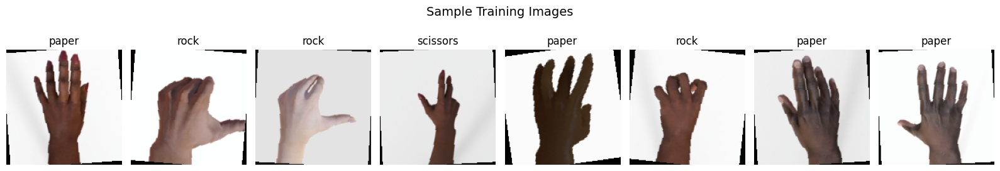
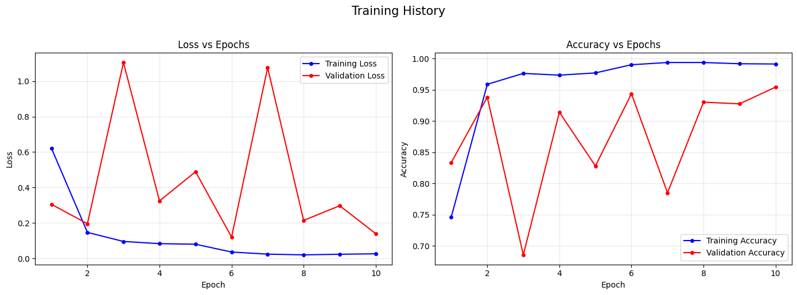
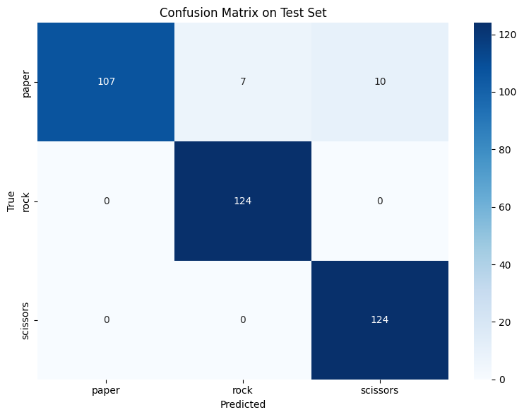
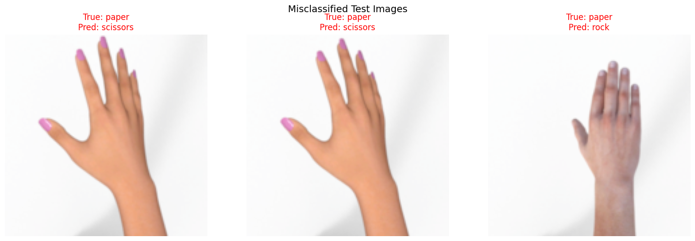
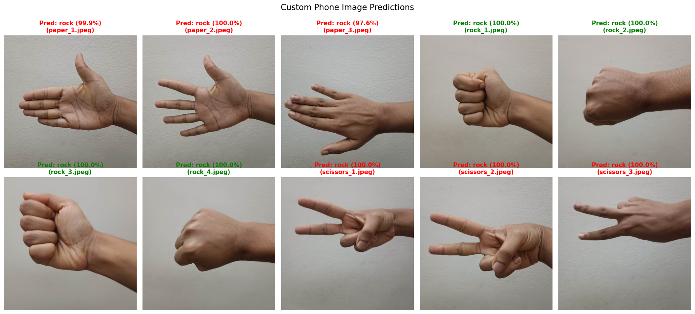

# 🤖 CNN Image Classification — Rock Paper Scissors (PyTorch)

**Student ID:** 220121  
**Name:** Shafikul Islam Marwan  
**Course:** CSE 3202 — Artificial Intelligence & Machine Learning Lab  
**Framework:** PyTorch  
**Environment:** Google Colab (GPU T4 / CPU)  
**Task:** Option 2 — Hand Gesture Classification (Rock, Paper, Scissors)

---

## 📋 Table of Contents

- [Project Overview](#project-overview)
- [Repository Structure](#repository-structure)
- [Dataset Description](#dataset-description)
- [Data Preprocessing & Augmentation](#data-preprocessing--augmentation)
- [Model Architecture](#model-architecture)
- [Training Configuration](#training-configuration)
- [Training Results](#training-results)
- [Evaluation on Standard Test Set](#evaluation-on-standard-test-set)
- [Visual Error Analysis](#visual-error-analysis)
- [Real-World Prediction on Custom Photos](#real-world-prediction-on-custom-photos)
- [Domain Gap Analysis](#domain-gap-analysis)
- [Possible Improvements](#possible-improvements)
- [How to Run](#how-to-run)
- [Dependencies](#dependencies)

---

## Project Overview

This project implements a complete **Convolutional Neural Network (CNN)** pipeline in PyTorch for classifying hand gestures into three classes: **Rock**, **Paper**, and **Scissors**.

The model is:
- **Trained from scratch** (no pretrained backbone) on the standard RPS dataset by Laurence Moroney.
- **Evaluated** on the standard held-out test set (372 images).
- **Tested on 10 custom smartphone photographs** of the author's own hand to assess real-world generalization.

The entire pipeline — dataset download, preprocessing, training, evaluation, and inference — runs **fully automatically** in Google Colab with a single "Run All". No manual file uploads or path changes are required.

---

## Repository Structure

```
Lab Final/
├── assets/                              # Plots & visualizations for README
│   ├── training_history.png
│   ├── confusion_matrix.png
│   ├── misclassified_images.png
│   ├── sample_training_images.png
│   └── custom_predictions_grid.png
├── dataset/                             # 10 custom smartphone photos
│   ├── paper_1.jpeg
│   ├── paper_2.jpeg
│   ├── paper_3.jpeg
│   ├── rock_1.jpeg
│   ├── rock_2.jpeg
│   ├── rock_3.jpeg
│   ├── rock_4.jpeg
│   ├── scissors_1.jpeg
│   ├── scissors_2.jpeg
│   └── scissors_3.jpeg
├── model/
│   └── 220121.pth                       # Saved model weights (state_dict)
├── Requirements & Submission Files/     # Lab report (PDF + LaTeX source)
│   ├── 220121_lab_report.pdf
│   ├── 220121_lab_report.tex
│   └── Assignment_8_CNN_Requirements.pdf
├── 220121.ipynb                         # Main Colab notebook (all code)
├── requirements.txt                     # Python dependencies
├── .gitignore
└── README.md
```

---

## Dataset Description

### Standard Dataset — Rock, Paper, Scissors (Laurence Moroney)

The model is trained and evaluated on the publicly available **synthetic RPS dataset** containing CGI-rendered images of hands making the three gestures against a plain background, at varying angles, skin tones, and lighting conditions.

| Split | Paper | Rock | Scissors | Total |
|:------|:-----:|:----:|:--------:|:-----:|
| Training | 840 | 840 | 840 | **2,520** |
| Test | 124 | 124 | 124 | **372** |
| **Total** | **964** | **964** | **964** | **2,892** |

> The dataset is **perfectly balanced** across all three classes.

**Download sources (auto-fetched by the notebook):**
- Training: `https://storage.googleapis.com/download.tensorflow.org/data/rps.zip`
- Test: `https://storage.googleapis.com/download.tensorflow.org/data/rps-test-set.zip`

#### Sample Training Images

<p align="center">
  
</p>
<p align="center"><em>Random batch from the training set with augmentation applied.</em></p>

### Custom Real-World Dataset

To evaluate real-world generalization, **10 original smartphone photographs** were taken of the author's hand performing the three gestures against a plain wall:

| Class | Count | Files |
|:------|:-----:|:------|
| Paper | 3 | `paper_1.jpeg`, `paper_2.jpeg`, `paper_3.jpeg` |
| Rock | 4 | `rock_1.jpeg`, `rock_2.jpeg`, `rock_3.jpeg`, `rock_4.jpeg` |
| Scissors | 3 | `scissors_1.jpeg`, `scissors_2.jpeg`, `scissors_3.jpeg` |

These are stored in the `dataset/` folder and are cloned automatically at runtime via `git clone`.

---

## Data Preprocessing & Augmentation

All images are resized to **150×150 pixels** and normalized using ImageNet mean/std statistics.

### Training Transforms

| # | Transform | Details |
|:--|:----------|:--------|
| 1 | `Resize(150, 150)` | Scale all images to uniform 150×150 |
| 2 | `RandomHorizontalFlip(p=0.5)` | 50% chance of horizontal flip |
| 3 | `RandomRotation(±10°)` | Random rotation between -10° and +10° |
| 4 | `ColorJitter(brightness=0.1, contrast=0.1)` | Slight brightness/contrast variation |
| 5 | `ToTensor()` | Convert PIL image to tensor, scale [0, 255] → [0, 1] |
| 6 | `Normalize(mean=[0.485, 0.456, 0.406], std=[0.229, 0.224, 0.225])` | ImageNet normalization |

### Test / Inference Transforms

| # | Transform | Details |
|:--|:----------|:--------|
| 1 | `Resize(150, 150)` | Scale to 150×150 |
| 2 | `ToTensor()` | Convert to tensor |
| 3 | `Normalize(mean=[0.485, 0.456, 0.406], std=[0.229, 0.224, 0.225])` | ImageNet normalization |

> **Note:** Augmentation is applied **only** during training to improve generalization. Test/inference uses deterministic transforms for consistent evaluation.

Data is loaded using `torchvision.datasets.ImageFolder` (which auto-assigns labels from folder names) and wrapped in `torch.utils.data.DataLoader` with `batch_size=64`.

---

## Model Architecture

A **3-block CNN built from scratch** (no pretrained weights) with a fully connected classifier head.

### Architecture Diagram

```
Input Image (3 × 150 × 150)
        │
        ▼
┌─────────────────────────────────────────┐
│  CONV BLOCK 1                           │
│  Conv2d(3 → 32, k=3, p=1)              │
│  BatchNorm2d(32)                        │
│  ReLU                                   │
│  MaxPool2d(2×2, stride=2)               │
│  Output: 32 × 75 × 75                  │
└─────────────────────────────────────────┘
        │
        ▼
┌─────────────────────────────────────────┐
│  CONV BLOCK 2                           │
│  Conv2d(32 → 64, k=3, p=1)             │
│  BatchNorm2d(64)                        │
│  ReLU                                   │
│  MaxPool2d(2×2, stride=2)               │
│  Output: 64 × 37 × 37                  │
└─────────────────────────────────────────┘
        │
        ▼
┌─────────────────────────────────────────┐
│  CONV BLOCK 3                           │
│  Conv2d(64 → 128, k=3, p=1)            │
│  BatchNorm2d(128)                       │
│  ReLU                                   │
│  MaxPool2d(2×2, stride=2)               │
│  Output: 128 × 18 × 18                 │
└─────────────────────────────────────────┘
        │
        ▼
┌─────────────────────────────────────────┐
│  CLASSIFIER HEAD                        │
│  AdaptiveAvgPool2d(4×4)  → 128 × 4 × 4 │
│  Flatten                 → 2048         │
│  Dropout(0.4)                           │
│  Linear(2048 → 256)                     │
│  ReLU                                   │
│  Dropout(0.3)                           │
│  Linear(256 → 3)                        │
│  Output: 3 (paper, rock, scissors)      │
└─────────────────────────────────────────┘
```

### Layer-by-Layer Summary

| Block | Layer | Input Channels | Output Channels | Kernel | Padding | Output Size |
|:------|:------|:--------------:|:---------------:|:------:|:-------:|:-----------:|
| Conv Block 1 | Conv2d + BN + ReLU + MaxPool | 3 | 32 | 3×3 | 1 | 32 × 75 × 75 |
| Conv Block 2 | Conv2d + BN + ReLU + MaxPool | 32 | 64 | 3×3 | 1 | 64 × 37 × 37 |
| Conv Block 3 | Conv2d + BN + ReLU + MaxPool | 64 | 128 | 3×3 | 1 | 128 × 18 × 18 |
| Adaptive Pool | AdaptiveAvgPool2d | 128 | 128 | — | — | 128 × 4 × 4 |
| Flatten | — | — | — | — | — | 2,048 |
| FC Layer 1 | Linear + ReLU | 2,048 | 256 | — | — | 256 |
| FC Layer 2 | Linear | 256 | 3 | — | — | 3 |

### Parameter Count

| Component | Parameters |
|:----------|:----------:|
| Conv Block 1 (Conv + BN) | 960 |
| Conv Block 2 (Conv + BN) | 18,624 |
| Conv Block 3 (Conv + BN) | 74,112 |
| FC Layer 1 (2048 → 256) | 524,544 |
| FC Layer 2 (256 → 3) | 771 |
| **Total** | **619,011** |

> All 619,011 parameters are **trainable** (no frozen layers).

### Key Design Choices

| Choice | Rationale |
|:-------|:----------|
| **3×3 kernels with padding=1** | Preserves spatial dimensions before pooling; captures local patterns effectively |
| **BatchNorm after Conv** | Stabilizes training, enables higher learning rates, acts as mild regularizer |
| **ReLU activation** | Avoids vanishing gradient problem, computationally efficient |
| **MaxPool2d(2×2)** | Halves spatial dimensions, provides translation invariance, reduces computation |
| **AdaptiveAvgPool2d(4×4)** | Ensures fixed-size output regardless of input resolution |
| **Dropout (0.4 + 0.3)** | Prevents overfitting by randomly deactivating neurons during training |

### Model Code

```python
class CNN(nn.Module):
    def __init__(self, num_classes=3):
        super(CNN, self).__init__()

        self.conv1 = nn.Sequential(
            nn.Conv2d(3, 32, kernel_size=3, padding=1),
            nn.BatchNorm2d(32),
            nn.ReLU(),
            nn.MaxPool2d(2, 2)
        )
        self.conv2 = nn.Sequential(
            nn.Conv2d(32, 64, kernel_size=3, padding=1),
            nn.BatchNorm2d(64),
            nn.ReLU(),
            nn.MaxPool2d(2, 2)
        )
        self.conv3 = nn.Sequential(
            nn.Conv2d(64, 128, kernel_size=3, padding=1),
            nn.BatchNorm2d(128),
            nn.ReLU(),
            nn.MaxPool2d(2, 2)
        )
        self.classifier = nn.Sequential(
            nn.AdaptiveAvgPool2d((4, 4)),
            nn.Flatten(),
            nn.Dropout(0.4),
            nn.Linear(128 * 4 * 4, 256),
            nn.ReLU(),
            nn.Dropout(0.3),
            nn.Linear(256, num_classes)
        )

    def forward(self, x):
        x = self.conv1(x)
        x = self.conv2(x)
        x = self.conv3(x)
        x = self.classifier(x)
        return x
```

---

## Training Configuration

| Hyperparameter | Value |
|:---------------|:------|
| Loss Function | `nn.CrossEntropyLoss` (combines Softmax + NLLLoss) |
| Optimizer | `Adam` (Adaptive Moment Estimation) |
| Learning Rate | 0.001 |
| Batch Size | 64 |
| Epochs | 10 |
| Input Image Size | 150 × 150 × 3 (RGB) |
| Output Classes | 3 (paper, rock, scissors) |
| Random Seed | 42 (for reproducibility) |
| Device | CUDA (GPU T4) if available, else CPU |

---

## Training Results

### Epoch-by-Epoch Metrics

| Epoch | Train Loss | Train Acc | Val Loss | Val Acc |
|:-----:|:----------:|:---------:|:--------:|:-------:|
| 1 | 0.6223 | 74.60% | 0.3053 | 83.33% |
| 2 | 0.1468 | 95.87% | 0.1956 | 93.82% |
| 3 | 0.0957 | 97.62% | 1.1049 | 68.55% |
| 4 | 0.0833 | 97.34% | 0.3243 | 91.40% |
| 5 | 0.0800 | 97.70% | 0.4889 | 82.80% |
| 6 | 0.0360 | 99.01% | 0.1203 | 94.35% |
| 7 | 0.0241 | 99.37% | 1.0759 | 78.49% |
| 8 | 0.0200 | 99.37% | 0.2145 | 93.01% |
| 9 | 0.0235 | 99.17% | 0.2970 | 92.74% |
| **10** | **0.0261** | **99.13%** | **0.1396** | **95.43%** |

### Training Curves

<p align="center">
  
</p>
<p align="center"><em>Training and validation loss (left) and accuracy (right) over 10 epochs.</em></p>

### Observations

- **Training loss** decreased steadily from 0.62 → 0.03, and **training accuracy** exceeded 99% by epoch 6.
- **Validation metrics fluctuated** around epochs 3 (val loss 1.10) and 7 (val loss 1.08), likely due to:
  - Small validation set (372 images) causing unstable batch statistics.
  - BatchNorm's sensitivity to batch-vs-running statistics during evaluation.
  - Adam optimizer's adaptive learning rate occasionally making aggressive updates.
- The model **recovered** each time and achieved its **best validation accuracy (95.43%)** at epoch 10.

---

## Evaluation on Standard Test Set

On the held-out RPS test set (372 images), the model achieved an overall accuracy of **95%**.

### Classification Report

| Class | Precision | Recall | F1-Score | Support |
|:------|:---------:|:------:|:--------:|:-------:|
| Paper | **1.00** | 0.86 | 0.93 | 124 |
| Rock | 0.95 | **1.00** | 0.97 | 124 |
| Scissors | 0.93 | **1.00** | 0.96 | 124 |
| | | | | |
| **Accuracy** | | | **0.95** | **372** |
| **Macro Avg** | 0.96 | 0.95 | 0.95 | 372 |
| **Weighted Avg** | 0.96 | 0.95 | 0.95 | 372 |

### Confusion Matrix

<p align="center">
  
</p>
<p align="center"><em>Confusion matrix on the standard RPS test set.</em></p>

### Key Findings

- ✅ **Rock:** 124/124 correct — **100% recall**, zero misclassifications.
- ✅ **Scissors:** 124/124 correct — **100% recall**, zero misclassifications.
- ⚠️ **Paper:** 107/124 correct — **86% recall**, the weakest class.
  - 10 paper images were misclassified as **scissors**.
  - 7 paper images were misclassified as **rock**.
- Total misclassifications: **17 out of 372** (all from the paper class).

> Paper's high **precision (1.00)** but lower **recall (0.86)** means that when the model predicts "paper", it's always correct — but it misses some actual paper images, labeling them as other classes.

---

## Visual Error Analysis

Out of 372 test images, **17 were misclassified** — all of them paper images. Three randomly sampled misclassified examples:

<p align="center">
  
</p>
<p align="center"><em>Three randomly selected misclassified test images with true vs. predicted labels.</em></p>

**Why paper was hardest to classify:**
- Some paper poses have fingers close together or partially curled.
- This makes the rendered silhouette visually ambiguous between an open paper hand and a partially-closed scissors/rock hand.

---

## Real-World Prediction on Custom Photos

The trained model was applied to all 10 custom smartphone photographs:

### Prediction Results

| Filename | True Label | Predicted | Confidence | Correct? |
|:---------|:-----------|:----------|:----------:|:--------:|
| paper_1.jpeg | paper | rock | 99.9% | ❌ |
| paper_2.jpeg | paper | rock | 100.0% | ❌ |
| paper_3.jpeg | paper | rock | 97.6% | ❌ |
| rock_1.jpeg | rock | rock | 100.0% | ✅ |
| rock_2.jpeg | rock | rock | 100.0% | ✅ |
| rock_3.jpeg | rock | rock | 100.0% | ✅ |
| rock_4.jpeg | rock | rock | 100.0% | ✅ |
| scissors_1.jpeg | scissors | rock | 100.0% | ❌ |
| scissors_2.jpeg | scissors | rock | 100.0% | ❌ |
| scissors_3.jpeg | scissors | rock | 100.0% | ❌ |

**Custom Photo Accuracy: 4/10 (40%)**

### Prediction Gallery

<p align="center">
  
</p>
<p align="center"><em>Predictions on all 10 custom photos. Green = correct, Red = incorrect.</em></p>

### Summary

- ✅ All 4 **rock** images: correctly identified with 100% confidence.
- ❌ All 3 **paper** images: incorrectly classified as rock (97–100% confidence).
- ❌ All 3 **scissors** images: incorrectly classified as rock (100% confidence).

> The model collapsed to predicting **"rock" for every single image**, only getting the actual rock photos right by coincidence.

---

## Domain Gap Analysis

The dramatic accuracy drop from **95% → 40%** is a textbook example of **Domain Shift / Distribution Shift**.

### Why Did This Happen?

| Factor | Standard Dataset (Training) | Custom Phone Photos (Testing) |
|:-------|:---------------------------|:------------------------------|
| **Origin** | CGI-rendered synthetic 3D hands | Real smartphone photographs |
| **Background** | Plain grey/white uniform backdrop | Real wall with shadows, texture, lighting |
| **Hand Appearance** | Smooth, stylized synthetic skin | Real skin with texture, veins, imperfections |
| **Framing** | Consistent distance, centered hand | Variable distance, angle, position |
| **Lighting** | Controlled, uniform CGI lighting | Natural, variable room lighting |

### Root Cause

The model was trained **from scratch** with only 619K parameters on 2,520 synthetic images. Instead of learning robust hand-shape features, it likely learned **low-level, dataset-specific cues** such as:
- Background texture and color patterns specific to the CGI renders
- Rendering artifacts unique to the synthetic dataset
- Specific lighting/shading patterns from the 3D rendering engine

### Why Did Rock Still Work?

A closed fist (rock) is a **visually simple, compact, high-contrast shape** — the most distinct of the three gestures. This basic shape was recognizable even across the domain boundary. In contrast, the detailed finger configurations of paper and scissors require more nuanced feature recognition that the small from-scratch model couldn't generalize.

---

## Possible Improvements

| Improvement | Expected Impact |
|:------------|:----------------|
| **Transfer Learning** — Use pretrained ResNet18/MobileNet backbone (ImageNet weights), fine-tune only the classifier head | Model would start with general, transferable visual features instead of learning from random initialization |
| **Stronger Augmentation** — Add background replacement, random cropping, Gaussian blur, perspective transforms | Reduces dependence on the synthetic plain background |
| **Domain Adaptation / Fine-tuning** — Fine-tune on even a small number of real photographs (5–10 per class) | Adapts the decision boundary to the real-world domain |
| **Diverse Training Data** — Mix real-photo RPS datasets with the CGI-rendered one during training | Better matches the deployment distribution |
| **Larger Model** — Use deeper architecture or more parameters | Greater capacity to learn complex, generalizable features |

---

## How to Run

### Quick Start (Google Colab)

1. Open the notebook: [`220121.ipynb`](https://colab.research.google.com/drive/1lCTyW3xMkFSMuc5Su9Zgi0NG4J7OAbLm?usp=sharing)
2. Go to **Runtime → Change runtime type → GPU (T4)** for faster training
3. Click **Runtime → Run all**
4. ✅ Everything runs automatically:
   - Clones this GitHub repo (for custom images)
   - Downloads the RPS dataset
   - Trains the CNN for 10 epochs
   - Saves model weights to `model/220121.pth`
   - Generates all plots and evaluation results

### What the Notebook Generates

| Output | Description |
|:-------|:------------|
| **Training Curves** | Loss and accuracy plots over 10 epochs (train + validation) |
| **Confusion Matrix** | Heatmap showing per-class prediction distribution on the test set |
| **Error Analysis** | 3 randomly sampled misclassified test images with true vs. predicted labels |
| **Custom Prediction Gallery** | All 10 smartphone photos with predicted class and confidence percentage |
| **Saved Model** | `model/220121.pth` — trained weights (state_dict) |

---

## Dependencies

```
torch>=2.0.0
torchvision>=0.15.0
numpy>=1.22.0
matplotlib>=3.7.0
seaborn>=0.12.0
scikit-learn>=1.2.0
pillow>=9.5.0
requests>=2.28.0
tqdm>=4.65.0
```

All dependencies are installed automatically by the notebook. See [`requirements.txt`](requirements.txt) for the full list.

---

## Links

| Resource | URL |
|:---------|:----|
| **GitHub Repository** | [Marwanthe0/CSE/.../Lab Final](https://github.com/Marwanthe0/CSE/tree/main/Third%20Year/3-2/Artificial%20Intelligence%20and%20ML/Lab%20Final) |
| **Google Colab Notebook** | [Open in Colab](https://colab.research.google.com/drive/1lCTyW3xMkFSMuc5Su9Zgi0NG4J7OAbLm?usp=sharing) |

---

<p align="center">
  <strong>CSE 3202 — Artificial Intelligence and Machine Learning Lab</strong><br/>
  Jashore University of Science and Technology<br/>
  Department of Computer Science and Engineering
</p>
